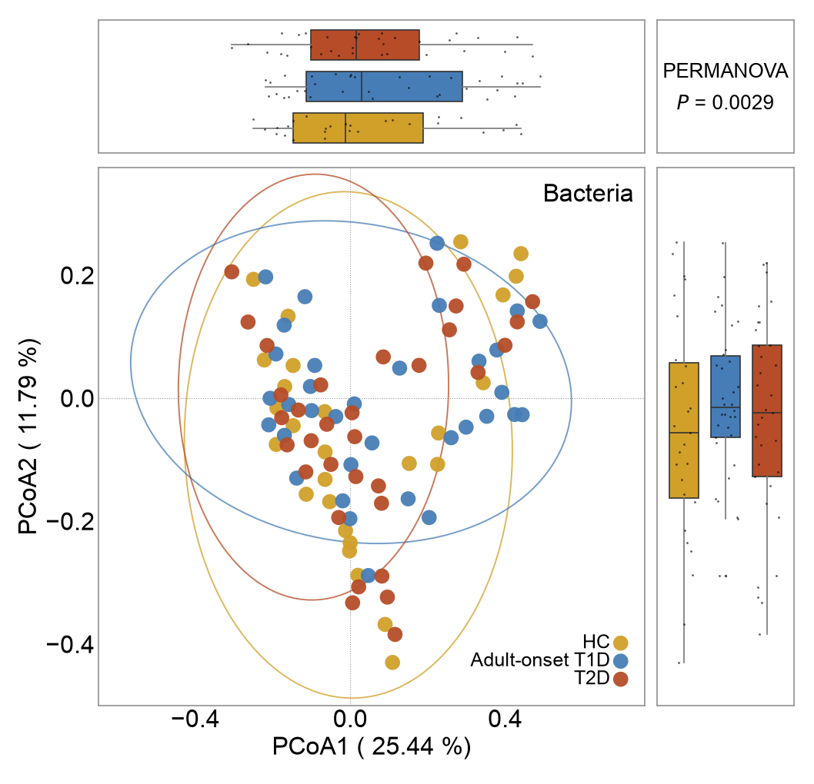
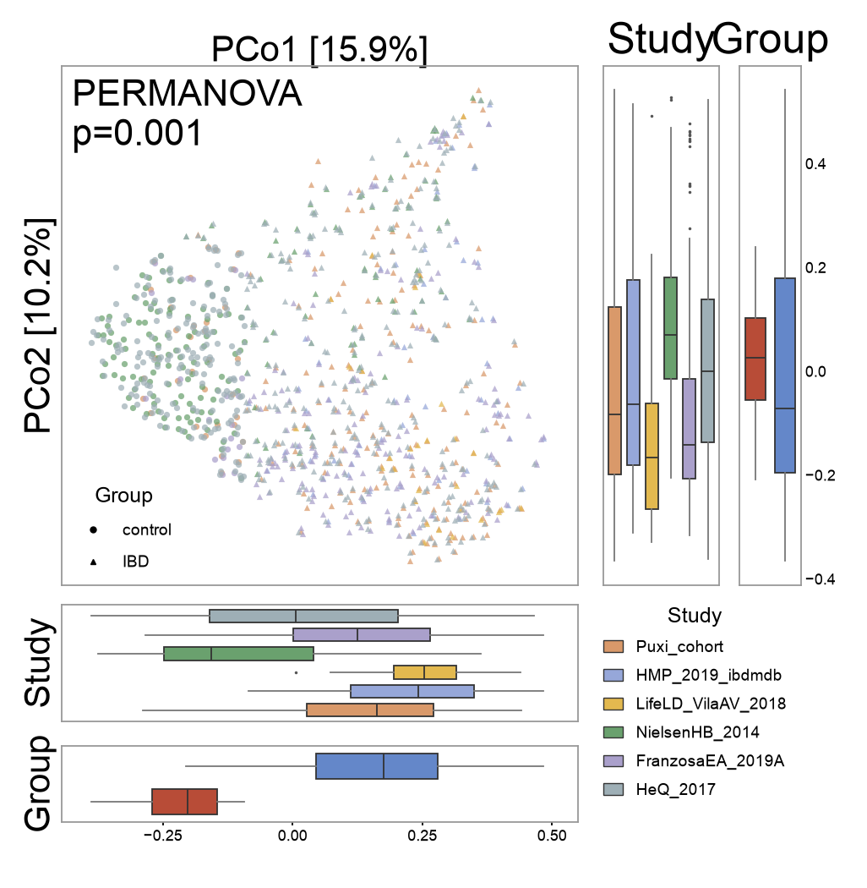
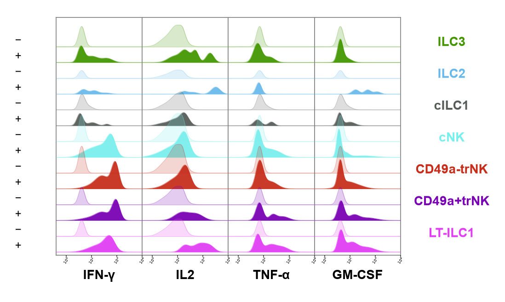
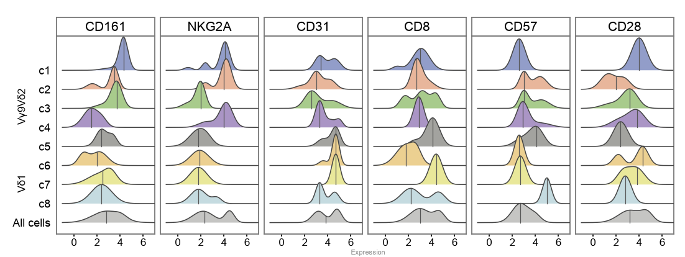
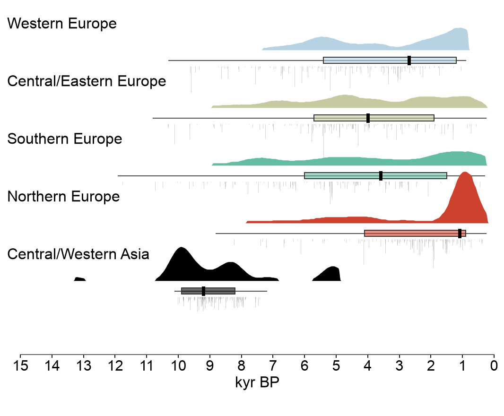
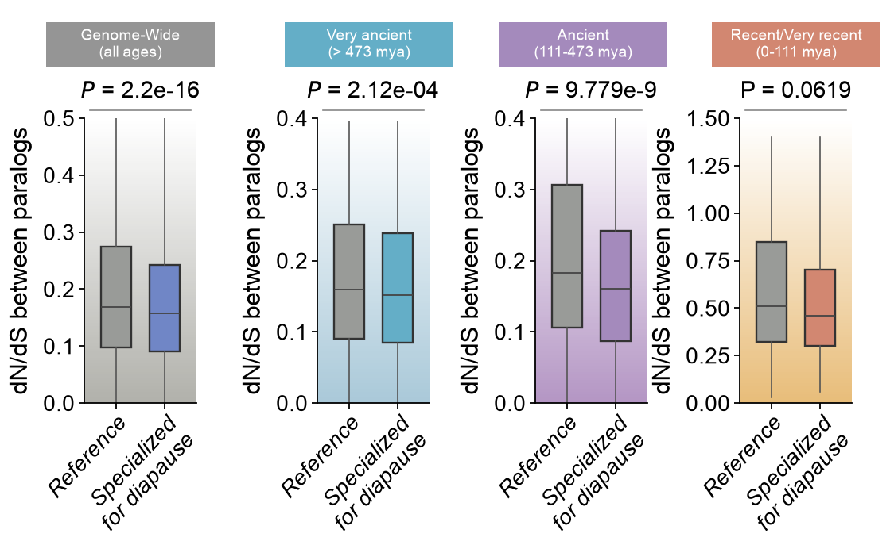

# Scientific Figure Gallery

[中文](README.md) | **English**

Reusable scientific figures in Python. The gallery currently contains 19 reconstructed examples, each with **its own plotting code, CSV demonstration data, JSON style, bilingual data documentation and preview**. Replace data, add chart types, and export PNG, SVG or PDF through a common runner.

These are approximate reconstructions from raster references, **not pixel-identical reproductions**. Original experimental data were not supplied. CSVs include screenshot estimates, digitized values, synthetic observations and fitted demonstration curves; phylogenetic topologies are synthetic too. Every figure records its provenance. Example values cannot support the original studies' statistical conclusions.

[Browse previews](docs/GALLERY.en.md) · [Original data required by each figure](docs/DATA.en.md) · [Add a figure](CONTRIBUTING.en.md)

## Quick start

Python 3.10+ is required. Run commands from the repository root:

```bash
git clone https://github.com/AdamsukS/scientific-figure-gallery.git
cd scientific-figure-gallery
python3 -m venv .venv
source .venv/bin/activate
python -m pip install -r requirements.txt

python render.py --list
python render.py --figure all --format png svg
python render.py --figure 7 --format png svg pdf
```

On Windows, use `py -m venv .venv` and `.venv\Scripts\Activate.ps1` in PowerShell. File Explorer can replace the `cp` commands below.

Outputs go to the git-ignored `output/` directory. PNGs preserve the reference canvas dimensions by default; `--scale 3` triples raster dimensions. SVG retains editable text; PDF embeds TrueType fonts. Arial is preferred when installed, with DejaVu Sans as fallback. Font substitution and antialiasing can differ across platforms.

## Run each figure independently

```bash
python -m figures.figure07.plot --format png svg
python -m figures.figure12.plot --out my_output --format pdf
```

`figures/figure07/plot.py` contains that figure's actual `draw(context, rows)` implementation, rather than delegating to a central function containing every chart. Small shared canvas, CSV, boxplot and KDE helpers live in `vizlib/common.py`. The batch runner discovers figure folders automatically.

```text
figures/
  figure07/
    plot.py               # Actual drawing code for this figure
    style.json            # Canvas, fonts, colors, labels, ordering
    data/
      figure07.csv        # Replaceable, provenance-labeled example data
    provenance.json       # Origin, fields, units, raw-data requirements, checksums
    example_hashes.json   # Published-example fingerprints for annotation handling
    README.md             # Chinese documentation
    README.en.md          # English documentation
    preview.png           # Rendered example
vizlib/common.py          # Small shared plotting helpers
render.py                 # Discovery and batch export
check_reuse.py            # Data replacement, export, metadata and extension checks
scripts/new_figure.py     # Create a new figure folder
scripts/build_gallery.py  # Refresh bilingual catalogs
```

## Replace the data

Read the target figure's “Original data you need” and “From raw data to plotting inputs” sections first. **Research raw data and plotting CSVs are different layers.** PCoA needs coordinates from an upstream analysis; phylogenetic plots need a real tree; dot plots need summaries computed from expression matrices.

```bash
cp -R figures/figure07/data my_data
# Edit my_data/figure07.csv
python render.py --figure 7 --data-dir my_data --out my_output --format png svg pdf
```

`--data-dir` accepts one figure's CSV directory, or a parent containing `figure01/`, `figure02/`, etc. for batch replacement. Update auxiliary tables together: figure 17's density, five-number summary and rug tables must describe the same observations.

Use UTF-8 and preserve column names and category values. Numeric columns do not accept missing values, NaN or Infinity. Changing groups, genes, units, panel counts or legend sample counts also requires updating the style. Fixed layouts do not automatically support arbitrary category counts; edit panel coordinates and marker sizes in that figure's `plot.py` as needed.

```bash
cp figures/figure07/style.json my_style.json
python render.py --figure 7 --style my_style.json --data-dir my_data --out my_output
```

### Means and errors

Figures 1, 6, 7 and 8 use the long table `category,group,sample,value,mean,error`. `value` is an observation; `mean/error` repeat the group-level display summary. Because occluded points cannot be recovered, the mean of estimated visible points may differ from the estimated bar height.

| Mode | Behavior |
|---|---|
| `--summary auto` (default) | Use provided mean/error for unchanged examples; recompute mean and SEM from value after CSV changes |
| `--summary samples` | Always compute mean and SEM; SEM = sample standard deviation / √n |
| `--summary provided` | Use supplied mean/error; document whether error means SD, SEM or CI |

Provided errors must be nonnegative, and repeated summary fields within a group must agree. A single observation is displayed with SEM 0; that does not establish absence of experimental uncertainty. Figures 4 and 9 accept precomputed summaries; figure 18 accepts five-number summaries rather than calculating them from experimental records.

### Statistical annotations

The code **does not infer significance from screenshots or replacement data**. Unchanged examples can show original P values and stars as visual references; those are not recomputed test results.

- `--annotations auto` (default): disable reference annotations when any related CSV changes.
- `--annotations none`: always hide reference annotations.
- `--annotations reference`: force reference annotations for appearance comparison only, not for reporting new experiments.

A figure's trusted `example_hashes.json` sits outside its data directory. A similarly named file in a replacement-data directory is not trusted. Do not modify fingerprints to apply old conclusions to new observations. Figure 9's three points are constructed reference-view symbols and are hidden for replacement data by default. Each run writes `render_log.json` with the actual modes and no machine-specific absolute paths.

### Raw observations for ridgelines

Figures 14–16 accept either prepared `x,density` curves or a `value` column replacing those two columns. Keep grouping columns unchanged; for example, figure 14 can accept:

```csv
panel,group,value
0,0,2.71
0,0,2.83
0,0,2.90
```

An actual file must include all groups expected by the style. Gaussian KDE is evaluated per group, with each peak normalized to 1.4 row spacings by default; an optional `height` column controls display height. That height represents neither sample count nor directly comparable absolute probability density across groups. Flow-cytometry observations must already be compensated, gated and transformed using the intended log/logicle/arcsinh procedure; these upstream steps are not implemented here.

## Figure index

Each link includes raw-data requirements, preprocessing conventions, example provenance, per-file fields/units, sample CSV rows and standalone commands.

<!-- FIGURES:START -->

| ID | Chart | Data provenance |
|---|---|---|
| 01 | [Outlined bars with sample points](figures/figure01/README.en.md) | `screenshot_estimate` |
| 02 | [PCoA with marginal boxplots](figures/figure02/README.en.md) | `digitized` |
| 03 | [Multi-cohort PCoA composite](figures/figure03/README.en.md) | `digitized` |
| 04 | [Time course with iAUC insets](figures/figure04/README.en.md) | `mixed` |
| 05 | [Half-violin raincloud plot](figures/figure05/README.en.md) | `synthetic_from_estimated_distribution` |
| 06 | [Broken-axis grouped bars](figures/figure06/README.en.md) | `screenshot_estimate` |
| 07 | [Gene-expression grouped bars](figures/figure07/README.en.md) | `screenshot_estimate` |
| 08 | [PARP1 variant grouped bars](figures/figure08/README.en.md) | `screenshot_estimate` |
| 09 | [Dual-axis nested bars](figures/figure09/README.en.md) | `mixed` |
| 10 | [Radial phylogeny with annotation rings](figures/figure10/README.en.md) | `synthetic` |
| 11 | [Circular phylogeny with heatmap rings](figures/figure11/README.en.md) | `synthetic` |
| 12 | [Grouped gene-expression dot plot](figures/figure12/README.en.md) | `digitized` |
| 13 | [Log-log scatter with marginal histograms](figures/figure13/README.en.md) | `synthetic` |
| 14 | [Molecular-dynamics ridgelines](figures/figure14/README.en.md) | `synthetic_fitted_curve` |
| 15 | [Flow-cytometry ridgeline matrix](figures/figure15/README.en.md) | `synthetic_fitted_curve` |
| 16 | [Cell-population expression ridgelines](figures/figure16/README.en.md) | `synthetic_fitted_curve` |
| 17 | [Regional age-distribution rainclouds](figures/figure17/README.en.md) | `mixed` |
| 18 | [Evolutionary-age faceted boxplots](figures/figure18/README.en.md) | `screenshot_estimate` |
| 19 | [Correlation, expression and proximity composite](figures/figure19/README.en.md) | `screenshot_estimate_and_digitized` |

## Code-generated figures

The figures below are generated by each Python module using the included example data.

### 01 · Outlined bars with sample points


[Code and data documentation](figures/figure01/README.en.md)

### 02 · PCoA with marginal boxplots



[Code and data documentation](figures/figure02/README.en.md)

### 03 · Multi-cohort PCoA composite



[Code and data documentation](figures/figure03/README.en.md)

### 04 · Time course with iAUC insets


[Code and data documentation](figures/figure04/README.en.md)

### 05 · Half-violin raincloud plot


[Code and data documentation](figures/figure05/README.en.md)

### 06 · Broken-axis grouped bars


[Code and data documentation](figures/figure06/README.en.md)

### 07 · Gene-expression grouped bars


[Code and data documentation](figures/figure07/README.en.md)

### 08 · PARP1 variant grouped bars


[Code and data documentation](figures/figure08/README.en.md)

### 09 · Dual-axis nested bars


[Code and data documentation](figures/figure09/README.en.md)

### 10 · Radial phylogeny with annotation rings


[Code and data documentation](figures/figure10/README.en.md)

### 11 · Circular phylogeny with heatmap rings


[Code and data documentation](figures/figure11/README.en.md)

### 12 · Grouped gene-expression dot plot


[Code and data documentation](figures/figure12/README.en.md)

### 13 · Log-log scatter with marginal histograms


[Code and data documentation](figures/figure13/README.en.md)

### 14 · Molecular-dynamics ridgelines


[Code and data documentation](figures/figure14/README.en.md)

### 15 · Flow-cytometry ridgeline matrix



[Code and data documentation](figures/figure15/README.en.md)

### 16 · Cell-population expression ridgelines



[Code and data documentation](figures/figure16/README.en.md)

### 17 · Regional age-distribution rainclouds



[Code and data documentation](figures/figure17/README.en.md)

### 18 · Evolutionary-age faceted boxplots



[Code and data documentation](figures/figure18/README.en.md)

### 19 · Correlation, expression and proximity composite


[Code and data documentation](figures/figure19/README.en.md)

<!-- FIGURES:END -->

## Add figure 20

```bash
python -m scripts.new_figure --id 20 --title "新的图表" --title-en "New chart"
python -m figures.figure20.plot --format png svg
```

The creator provides a runnable two-group synthetic example and refuses to overwrite an existing figure. Replace `plot.py`, `style.json`, `data/`, `provenance.json` and both READMEs with your chart, then refresh the preview and catalogs:

```bash
cp output/figure20.png figures/figure20/preview.png
python -m scripts.build_gallery
python check_reuse.py
```

`render.py --figure all` automatically includes the new folder; there is no central registry to edit. See [CONTRIBUTING.en.md](CONTRIBUTING.en.md) for source documentation, tree input and fingerprint updates.

## Validation and scope

```bash
python check_reuse.py
```

The check renders original and modified CSVs for every figure, verifies dimensions, confirms SVGs contain no embedded bitmaps, checks that data changes affect the image and disable old annotations, and validates documentation, fields and fingerprints. It also creates and runs a new figure in a temporary project to verify the extension workflow. GitHub Actions runs the same checks on pushes and pull requests.

After splitting the 19 initial modules, their output was pixel-identical to the pre-split previews in the same local font/dependency environment. **That is a refactoring regression check, not a claim of pixel identity with the source document.** Scientific methods, data authenticity and final conclusions must be established from actual data and the original analysis pipeline.

The original Word file, reference screenshots, local comparison page, virtual environment and temporary files are excluded from this public repository. Previews are code-generated reconstructions. Published synthetic/estimated CSVs are sufficient to render every template without reference images. Source papers/DOIs have not been verified; `source_publication` is explicitly null.

## License

[MIT](LICENSE) covers the project code and project-authored documentation. The nature of synthetic/estimated data is recorded per file. This repository does not claim or grant rights to reference publications, original study datasets or third-party images.

---

Figure recreations are based on images from **Nature**. The figures shown above are generated by this project's code; specific papers and DOIs are yet to be added.
