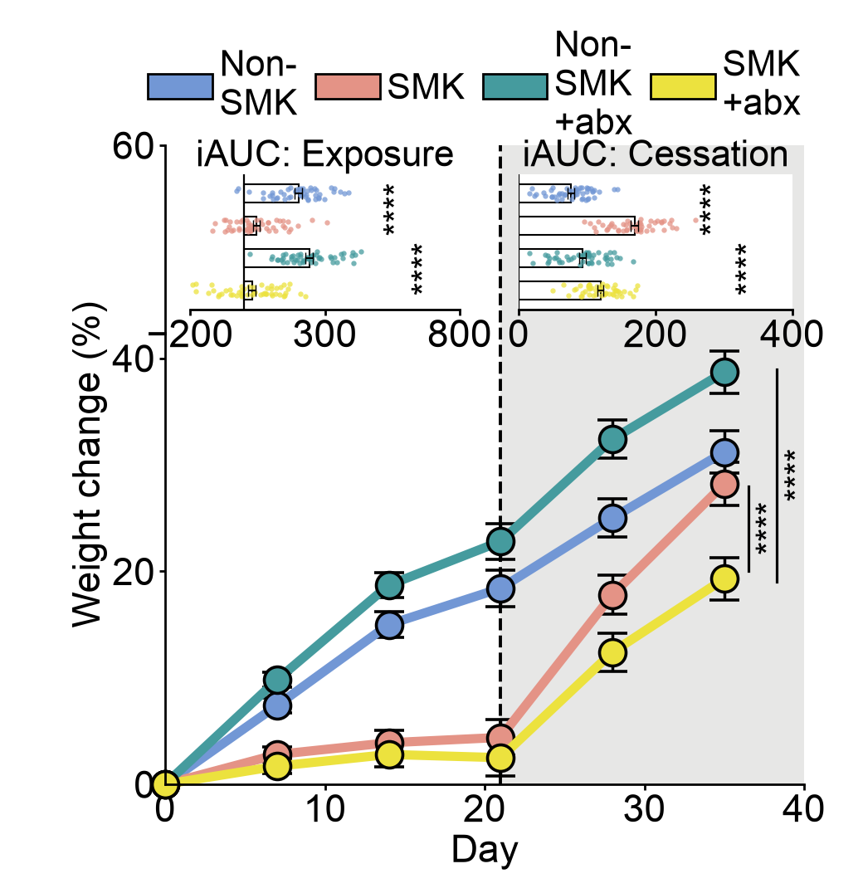

# 04 · Time course with iAUC insets

[中文](README.md) | **English**

[← Gallery index](../../README.en.md)



## Data provenance

**mixed** — Time-course means and errors were visually estimated. Inset observations are seeded synthetic examples.

Original experimental data were not supplied, and a paper/DOI has not been verified. These values demonstrate a reusable chart layout; they are not original research measurements or a pixel-identical reproduction.

## Original data you need

- Weight, baseline weight, treatment and subject ID for each animal/day, preserving longitudinal pairing.
- Weight-change formula, Exposure/Cessation windows, and the iAUC integration and baseline definitions.
- Individual iAUC values, group means, the specified SD/SEM/CI and original statistical tests.

## From raw data to plotting inputs

The time-course CSV accepts mean/error. Calculate individual iAUC upstream and supply the inset table; the code does not infer individual iAUC from mean curves.

## Files and columns

`plot.py` contains the actual drawing code; `style.json` controls canvas, labels, colors and ordering; `data/` holds replaceable CSVs. `provenance.json` records per-file provenance, row count, SHA-256, columns and units.

### [figure04.csv](data/figure04.csv)

`mixed` · 24 rows. Missing/NaN/Inf numeric values are unsupported; use UTF-8.

| Column | Type | Unit | Meaning |
|---|---|---|---|
| `group` | string | label | Experimental group or cell population; match style |
| `day` | number | day | Days relative to experimental start |
| `mean` | number | percent weight change | Group mean; repeat the same summary within each group |
| `error` | number ≥ 0 | percent weight change | Error magnitude; explicitly specify SD/SEM/CI |

```csv
group,day,mean,error
"Non-
SMK",0,0,0
"Non-
SMK",7,7.4,0.7
```

### [figure04_insets.csv](data/figure04_insets.csv)

`synthetic` · 400 rows. Missing/NaN/Inf numeric values are unsupported; use UTF-8.

| Column | Type | Unit | Meaning |
|---|---|---|---|
| `phase` | string | label | Exposure or Cessation inset phase |
| `group` | string | label | Experimental group or cell population; match style |
| `value` | number | iAUC in the documented integration convention | One observation; units/normalization are specified in this figure’s raw-data requirements |

```csv
phase,group,value
Exposure,"Non-
SMK",260.8027
Exposure,"Non-
SMK",173.563
```

## Run and replace data

```bash
python -m figures.figure04.plot --format png svg
cp -R figures/figure04/data my_data
# Edit the relevant CSVs in my_data, then run:
python render.py --figure 4 --data-dir my_data --out my_output --format png svg pdf
```

Run commands from the repository root. Changing groups, genes, panel counts, sample-count labels or units also requires updating style.json and, where necessary, plot.py layout. A fixed canvas does not adapt to arbitrary group counts. Original statistical annotations are disabled by default when CSVs change. See the [main README](../../README.en.md) for summary modes.
