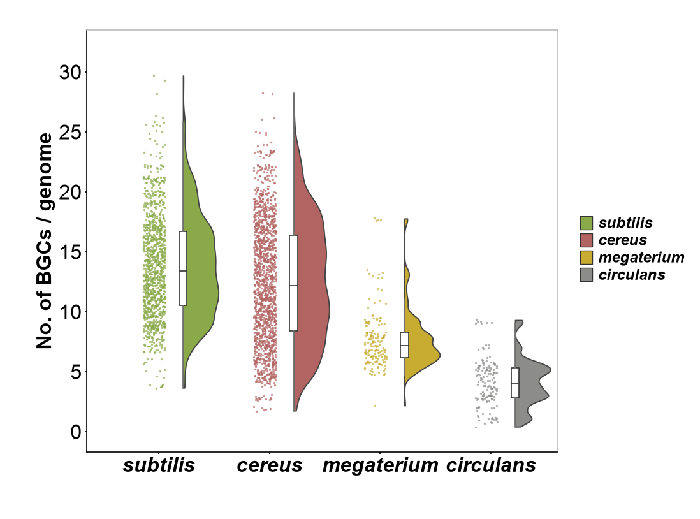

# 05 · 半小提琴 雨云图

**中文** | [English](README.en.md)

[← 返回总目录](../../README.md)



## 数据来源

**synthetic_from_estimated_distribution** — 截图散点区域颜色占比估计分布，并生成示例点；不能恢复重叠样本

原始实验数据未提供；论文/DOI 尚未核实。这里的值仅用于图式复用，不是原始研究数据，也不构成像素完全一致的复现。

## 需要哪些原始数据

- 每个 genome 的唯一编号、物种/类别和 BGC 数量。
- 基因组筛选规则、BGC 检测方法/版本，以及一条记录代表的独立观测单位。
- KDE 带宽、箱线图 whisker 规则，以及是否包含异常值。

## 从原始数据到绘图输入

每行对应一个 genome 的 BGC 计数，代码从 value 计算 KDE 与箱线统计；jitter 只是水平排点偏移。

## 文件与字段

`plot.py` 是本图实际绘图代码；`style.json` 控制画布、标签、颜色和分类顺序；`data/` 保存可替换 CSV。`provenance.json` 逐文件记录来源类别、行数、SHA-256、字段含义与单位。

### [figure05.csv](data/figure05.csv)

`synthetic_from_estimated_distribution` · 2920 行。空值/NaN/Inf 不受支持；字段使用 UTF-8。

| 字段 | 类型 | 单位 | 含义 |
|---|---|---|---|
| `group` | string | label | 实验组或细胞群；与样式一致 |
| `value` | number | BGC count / genome | 单个观测值；单位及归一化见本图原始数据要求 |
| `jitter` | number, optional | display offset | 只控制散点水平偏移；可省略 |

```csv
group,value,jitter
subtilis,16.6301,0.4465
subtilis,15.1716,0.0156
```

## 运行与替换数据

```bash
python -m figures.figure05.plot --format png svg
cp -R figures/figure05/data my_data
# 修改 my_data 内所有对应 CSV，再运行：
python render.py --figure 5 --data-dir my_data --out my_output --format png svg pdf
```

命令均从仓库根目录执行。修改组名、基因名、面板数、样本量标签或量纲时，也要修改 `style.json` 与必要的 `plot.py` 布局；固定画布不会自动容纳任意数量的分组。示例原图统计标注在 CSV 改动后默认停用。完整统计模式说明见[总 README](../../README.md)。
