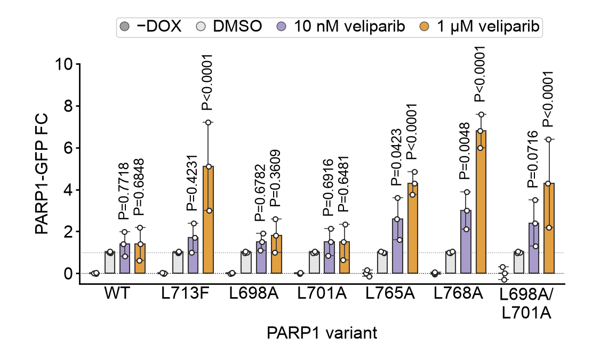

# 08 · PARP1 variant grouped bars

[中文](README.md) | **English**

[← Gallery index](../../README.en.md)



## Data provenance

**screenshot_estimate** — Manual estimates of means and errors; example points are constructed from those summaries, not measured replicates.

Original experimental data were not supplied, and a paper/DOI has not been verified. These values demonstrate a reusable chart layout; they are not original research measurements or a pixel-identical reproduction.

## Original data you need

- GFP measurements and biological replicate IDs for each PARP1 variant and drug condition.
- Background subtraction, −DOX/DMSO controls, fold-change normalization and pairing rules.
- Actual replicate values, summary-error definition and test results; mean ± error is not a substitute for replicates.

## From raw data to plotting inputs

Normalize fold changes upstream and provide actual replicates. Screenshot-example points constructed from estimated summaries cannot support inference.

## Files and columns

`plot.py` contains the actual drawing code; `style.json` controls canvas, labels, colors and ordering; `data/` holds replaceable CSVs. `provenance.json` records per-file provenance, row count, SHA-256, columns and units.

### [figure08.csv](data/figure08.csv)

`screenshot_estimate` · 84 rows. Missing/NaN/Inf numeric values are unsupported; use UTF-8.

| Column | Type | Unit | Meaning |
|---|---|---|---|
| `category` | string | label | Category/condition; match style ordering |
| `group` | string | label | Experimental group or cell population; match style |
| `sample` | string | identifier | Example replicate ID; preserve real sample IDs when available |
| `value` | number | normalized expression / fold change | One observation; units/normalization are specified in this figure’s raw-data requirements |
| `mean` | number | normalized expression / fold change | Group mean; repeat the same summary within each group |
| `error` | number ≥ 0 | normalized expression / fold change | Error magnitude; explicitly specify SD/SEM/CI |

```csv
category,group,sample,value,mean,error
WT,−DOX,1,-0.02,0,0.02
WT,−DOX,2,0,0,0.02
```

## Run and replace data

```bash
python -m figures.figure08.plot --format png svg
cp -R figures/figure08/data my_data
# Edit the relevant CSVs in my_data, then run:
python render.py --figure 8 --data-dir my_data --out my_output --format png svg pdf
```

Run commands from the repository root. Changing groups, genes, panel counts, sample-count labels or units also requires updating style.json and, where necessary, plot.py layout. A fixed canvas does not adapt to arbitrary group counts. Original statistical annotations are disabled by default when CSVs change. See the [main README](../../README.en.md) for summary modes.
