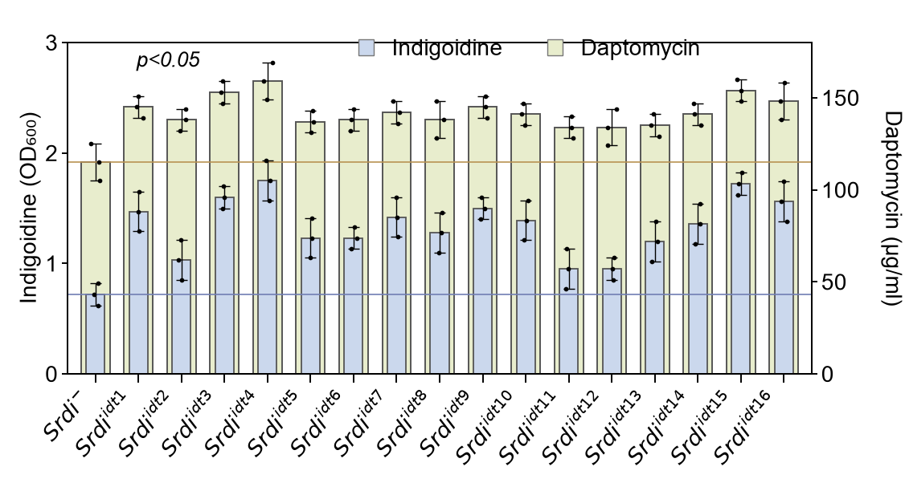

# 09 · 双轴嵌套柱状图

**中文** | [English](README.en.md)

[← 返回总目录](../../README.md)



## 数据来源

**mixed** — 双轴柱高 误差人工估读；三重复为示例

原始实验数据未提供；论文/DOI 尚未核实。这里的值仅用于图式复用，不是原始研究数据，也不构成像素完全一致的复现。

## 需要哪些原始数据

- 每个菌株/构建体和独立重复的 Indigoidine OD600 与 Daptomycin 浓度（μg/ml）。
- 检测、标准曲线、稀释系数及两项测量的配对关系。
- 两套组均值和误差类型，以及 0.72/115 基准线的实际来源。

## 从原始数据到绘图输入

提供两套真实汇总值及指定误差。参考视图中的三个点是构造的外观标记，不是原始重复；新数据默认不绘制它们。

## 文件与字段

`plot.py` 是本图实际绘图代码；`style.json` 控制画布、标签、颜色和分类顺序；`data/` 保存可替换 CSV。`provenance.json` 逐文件记录来源类别、行数、SHA-256、字段含义与单位。

### [figure09.csv](data/figure09.csv)

`mixed` · 17 行。空值/NaN/Inf 不受支持；字段使用 UTF-8。

| 字段 | 类型 | 单位 | 含义 |
|---|---|---|---|
| `category` | string | label | 分类/条件；与样式顺序一致 |
| `indigo` | number | OD600 | Indigoidine OD600 组均值 |
| `indigo_error` | number ≥ 0 | OD600 | Indigoidine 对应误差 |
| `daptomycin` | number | μg/ml | Daptomycin 浓度组均值 |
| `dap_error` | number ≥ 0 | μg/ml | Daptomycin 对应误差 |

```csv
category,indigo,indigo_error,daptomycin,dap_error
$Srdi^{-}$,0.72,0.1,115,10
$Srdi^{idt1}$,1.47,0.18,145,6
```

## 运行与替换数据

```bash
python -m figures.figure09.plot --format png svg
cp -R figures/figure09/data my_data
# 修改 my_data 内所有对应 CSV，再运行：
python render.py --figure 9 --data-dir my_data --out my_output --format png svg pdf
```

命令均从仓库根目录执行。修改组名、基因名、面板数、样本量标签或量纲时，也要修改 `style.json` 与必要的 `plot.py` 布局；固定画布不会自动容纳任意数量的分组。示例原图统计标注在 CSV 改动后默认停用。完整统计模式说明见[总 README](../../README.md)。
