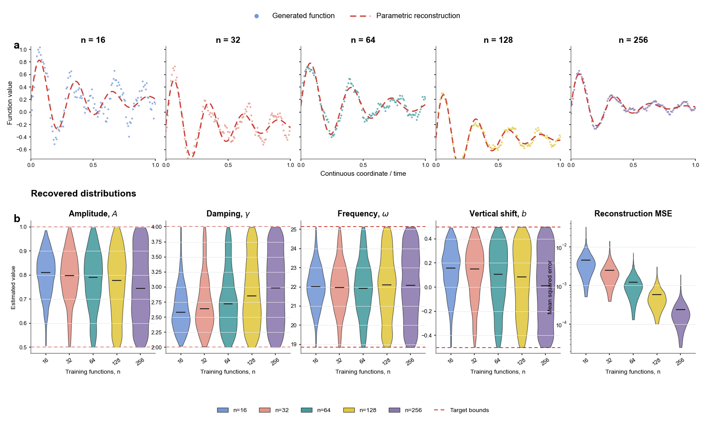

# 23 · 时序函数生成与完整分布评估

**中文** | [English](README.en.md)

[← 返回总目录](../../README.md)



## 图式用途

用于回答“生成模型是否学到完整的函数分布”。上排按训练样本量展示生成函数与参数化重建的 worst-case 对比；下排同时比较函数参数分布和重建误差。该组合适合时序、光谱、轨迹、传感器响应和其他一维函数数据。

构图参考 Wang 等人在 Nature Communications 发表的 FunDiff 论文 Figure 2：[`10.1038/s41467-026-72292-0`](https://doi.org/10.1038/s41467-026-72292-0)。官方实现见 [`sifanexisted/fundiff`](https://github.com/sifanexisted/fundiff)。

## 数据来源

**deterministic_synthetic_inspired_by_published_layout** — 随附 CSV 由 `simulate_data.py` 使用固定种子 `20260427` 生成，仅用于展示可复用图式。它们不是论文原始数据、作者 checkpoint 的输出，也不是对论文图中数值的数字化提取。

模拟器设定训练函数数为 `16, 32, 64, 128, 256`；每组生成 1,024 条参数记录。随着训练样本量增加，代理参数分布由有偏 Beta 分布逐渐混合为目标均匀分布，同时 MSE 的中位数下降。上排曲线使用每组最大 MSE 记录构造一致的残差示例。

## 真实复用所需数据

- 每个模型对应的训练函数数量、随机种子和模型/配置标识。
- 每条生成函数的 `sample_id`、坐标、生成值，以及同一坐标上的拟合或重建值。
- 每条函数拟合得到的幅值 `A`、阻尼 `gamma`、角频率 `omega`、竖直位移 `b` 和 MSE。
- 目标参数分布或可信边界。真实任务没有解析参数时，应换成有定义的峰值、导数、积分、频谱能量或其他函数特征。

对真实模型结果，上排每组选择 MSE 最大的曲线；下排必须使用与生成曲线来自同一批样本的拟合参数和 MSE。不要保留演示 CSV 与真实输出混用。

## 文件与字段

### `data/figure23_parameters.csv`

5,120 行；每行是一条生成函数的拟合摘要。

| 字段 | 类型 | 单位 | 含义 |
|---|---|---|---|
| `train_n` | integer | functions | 训练函数数量 |
| `sample_id` | integer | ID | 组内生成样本编号 |
| `amplitude` | number | function-value units | 拟合幅值 A |
| `damping` | number | inverse coordinate | 阻尼系数 gamma |
| `frequency` | number | radian per coordinate | 角频率 omega |
| `shift` | number | function-value units | 竖直位移 b |
| `mse` | positive number | squared function-value units | 生成与重建曲线的 MSE |

### `data/figure23_curves.csv`

640 行；每个训练样本量对应 128 个坐标点。

| 字段 | 类型 | 单位 | 含义 |
|---|---|---|---|
| `train_n` | integer | functions | 训练函数数量 |
| `time` | number | normalized coordinate [0,1] | 连续坐标或归一化时间 |
| `generated` | number | function-value units | 生成函数值 |
| `reconstructed` | number | function-value units | 参数化重建值 |

## 运行

从仓库根目录执行：

```bash
python -m figures.figure23.simulate_data
python -m figures.figure23.plot --format png svg pdf
```

替换真实 CSV 后可用统一入口：

```bash
python render.py --figure 23 --data-dir ./my_figure23_data --out ./my_output --format png svg pdf --annotations none
```

修改训练样本量、参数范围、画布标题或颜色时，同时更新 `style.json`。真实输出不应运行 `simulate_data.py`，否则会覆盖数据目录中的 CSV。
